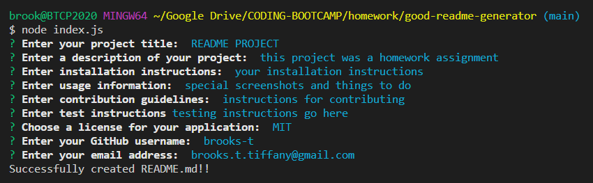

# GOOD README GENERATOR

## DESCRIPTION
This project was created for a homwork assignment in the University of Washington Coding Bootcamp. It is a README generator. To use it, open a terminal and navigate to the root directory that this file is contained in. Type 'node index.js' to launch the app. Once the app is launched you will be asked a series of questions designed to fill out your README in its entirety. Once you've successfully answer all of the questions, a success message will display and your README 'sampleREADME.md' will be generated in the root folder.

## USAGE
Please watch this [Video Tutorial](https://drive.google.com/file/d/1RWX4m_PHw2ORoCjgz3zJm9tq97tXG-R8/view) for a walkthrough of the app.

Below is a screenshot of the app process starting with 'node index.js' to lauch it and a success message when completed.

## QUESTIONS
Contact me through GitHub or Email
* GitHub: [brooks-t](https://github.com/brooks-t)
* Email: brooks.t.tiffany@gmail.com

## LICENSE
[MIT](https://choosealicense.com/licenses/mit/)